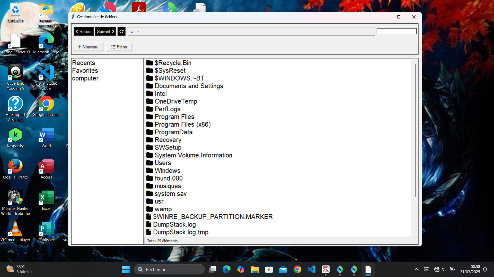

# Documentation du Projet : Explorateur de Fichiers avec Tkinter

## Fonctionnalités Implémentées

### 1. Interface Graphique et Navigation
- **Barre de chemin interactive** : Affiche le chemin actuel avec des boutons cliquables pour chaque segment du chemin (implémentée via `update_path_display()` et `switch_to_entry()`).
- **Navigation hiérarchique** : Double-clic sur un dossier pour y accéder, boutons Retour/Suivant (`go_back()`, `go_ahead()`).
- **Affichage des icônes** : Utilisation de Font Awesome pour les icônes de dossiers (📁) et fichiers (📄).

### 2. Gestion des Favoris et Récents
- **Marquage des favoris** : Ajout/suppression via le menu contextuel (`add_to_favorites()`, `delete_favorites()`).
- **Affichage des favoris** : Section dédiée avec accès direct aux éléments (`show_favorites()`).
- **Historique récent** : Enregistrement automatique des fichiers ouverts (`add_to_recents()`).

### 3. Opérations sur les Fichiers
- **Menu contextuel** : Options spécifiques selon le contexte (clic sur un élément vs espace vide) :
  - **Élément sélectionné** : Ouvrir, Renommer, Copier/Coller, Supprimer (`show_item_menu()`).
  - **Espace vide** : Création de dossiers/fichiers (`show_space_menu()`).
- **Calcul de taille** : Affichage asynchrone des propriétés des fichiers/dossiers (`show_properties()`).

### 4. Fonctionnalités Avancées
- **Filtrage des fichiers** : Par type (images, documents, etc.) via `apply_filter()`.
- **Recherche instantanée** : Barre de recherche dynamique (`update_search()`).
- **Gestion des erreurs** : Messages clairs pour les accès refusés ou chemins invalides.

---

## Problèmes Rencontrés et Solutions

### 1. Gestion des Chemins d'Accès
**Problème** :  
La permutation entre l'affichage du chemin cliquable et un champ de saisie manuelle était complexe à synchroniser.  
**Solution** :  
- Utilisation de `switch_to_entry()` pour basculer vers un champ de saisie au clic.
- Mise à jour automatique via `load_directory()` après validation.

### 2. Icônes et Police FontAwesome
**Problème** :  
L'affichage des icônes nécessitait une police externe, ce qui pouvait causer des erreurs si non installée.  
**Solution** :  
- Vérification de la présence de la police au démarrage (`font.nametofont("FA")`).
- Fallback vers des caractères Unicode standards si la police est absente.

### 3. Menus Contextuels Dynamiques
**Problème** :  
Distinguer un clic droit sur un élément vs un espace vide pour afficher le bon menu.  
**Solution** :  
- Détection de la position via `file_list.bbox()` dans `right_click()`.
- Affichage conditionnel de `show_item_menu()` ou `show_space_menu()`.

### 4. Calcul de Taille des Dossiers
**Problème** :  
Le calcul récursif de la taille des dossiers bloquait l'interface.  
**Solution** :  
- Implémentation asynchrone avec `threading` dans `show_properties()`.
- Annulation possible via `cancel_event`.

### 5. Synchronisation Base de Données/Fichiers
**Problème** :  
Les favoris pouvaient référencer des fichiers supprimés.  
**Solution** :  
- Nettoyage automatique dans `show_favorites()` et `show_recents()` via `os.path.exists()`.
- Suppression en cascade lors de la suppression de fichiers (`delete_selected_items()`).

---

## Captures d'Écran (Exemples)
1. **Navigation Standard**  
      
   *Barre de chemin, liste des fichiers, et boutons de navigation.*

2. **Menu Contextuel**  
     
   *Options pour un fichier sélectionné (Ouvrir, Renommer, etc.).*

3. **Gestion des Favoris**  
     
   *Liste des éléments marqués comme favoris.*

---

## Conclusion
L'équipe a surmonté plusieurs défis techniques, notamment la gestion des événements complexes et l'intégration de polices externes. Les solutions adoptées garantissent une interface réactive et intuitive, conformément aux spécifications du projet. Les fonctionnalités clés comme les favoris, la recherche, et les menus contextuels dynamiques ont été particulièrement optimisées pour l'expérience utilisateur.

**Prochaines améliorations possibles** :  
- Ajout d'un système d'onglets pour naviguer dans plusieurs dossiers simultanément.
- Intégration d'un lecteur de prévisualisation pour les fichiers multimédias.

--- 

